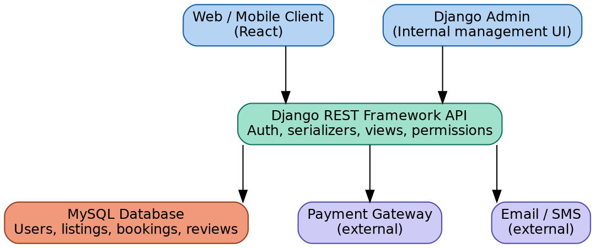

# Hyperlocal Services Marketplace

A local services booking platform where customers can discover and book verified service providers — inspired by Urban Company.

## Overview
Finding trustworthy local service providers is fragmented and unreliable. This platform centralizes service discovery, booking, and reviews for customers, providers, and admins in one place, with role-based access and a full booking lifecycle.

## Architecture Diagram


## Tech Stack

| Layer | Technology |
|---|---|
| Frontend | React.js + Axios |
| Backend | Django REST Framework |
| Auth | Django SimpleJWT |
| ORM | Django ORM |
| Database | MySQL 8 |
| Testing | Pytest |
| API Docs | drf-yasg (Swagger) |
| CI/CD | GitHub Actions |
| Backend Hosting | Render / Railway |
| Frontend Hosting | Vercel / Netlify |

## Features
- **Auth**: role-based registration/login (customer, provider, admin) with JWT
- **Services**: providers create and manage service listings under categories
- **Bookings**: customers book services for a scheduled time, with status tracking (pending → confirmed → completed)
- **Reviews**: customers leave ratings and comments after a completed booking
- **Admin**: manage categories, oversee users and listings via Django admin

## Screenshots
_Coming soon — added after frontend integration._

## Getting Started

### Prerequisites
- Python 3.11+
- MySQL 8
- Node.js 18+ (for frontend)

### Backend Setup
```bash
git clone https://github.com/aadhilbanu/hyperlocal-service-masterplace.git
cd hyperlocal-service-masterplace
python -m venv venv
venv\Scripts\activate        # Windows
pip install -r backend/requirements.txt
```

Create a `.env` file in the project root (see `.env.example` for required variables), then:

```bash
cd backend
python manage.py migrate
python manage.py createsuperuser
python manage.py runserver
```

Backend runs at `http://127.0.0.1:8000`. Admin panel at `http://127.0.0.1:8000/admin`.

### Frontend Setup
```bash
cd frontend
npm install
npm run dev
```

## Environment Variables

| Variable | Description | Required |
|---|---|---|
| `DB_NAME` | MySQL database name | Y |
| `DB_USER` | MySQL username | Y |
| `DB_PASSWORD` | MySQL password | Y |
| `DB_HOST` | MySQL host (e.g. `localhost`) | Y |
| `DB_PORT` | MySQL port (default `3306`) | Y |

## API Documentation
_Swagger UI link added after deployment (Day 41)._

## Running Tests
```bash
cd backend
pytest
```

## Deployment
_Deployment details added after Review-II (Day 41)._

## Folder Structure
```
hyperlocal-service-masterplace/
├── backend/
│   ├── manage.py
│   ├── core/           # project settings
│   ├── users/          # custom User model, auth
│   ├── services/        # ServiceCategory, ServiceListing
│   └── bookings/        # Booking model
├── docs/
│   └── diagrams/        # architecture, ER, class diagrams
├── Problem_Statement.md
└── README.md
```

## Future Enhancements
- Geolocation-based provider matching
- ML-based service recommendations
- Real-time booking notifications

## License
MIT

## Author
Aadhil Banu
